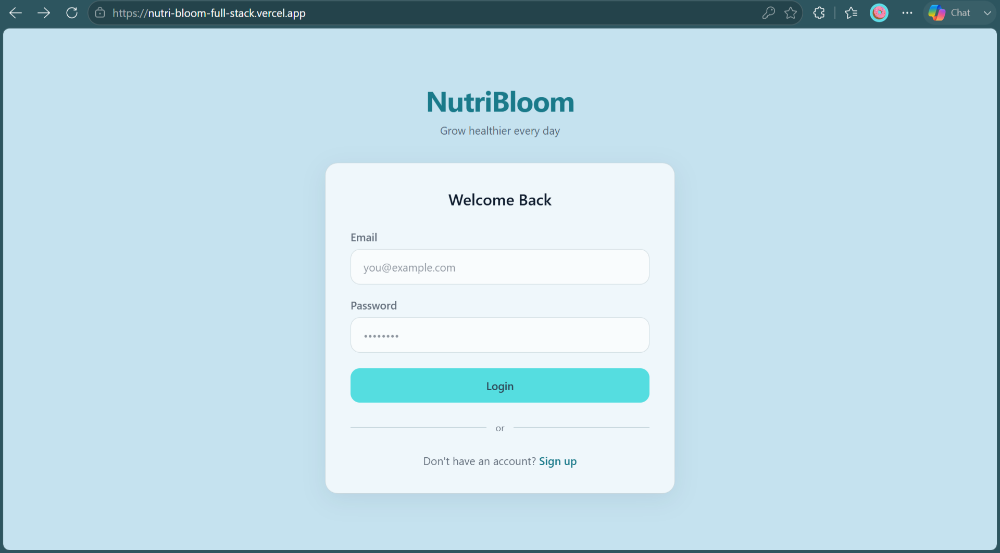
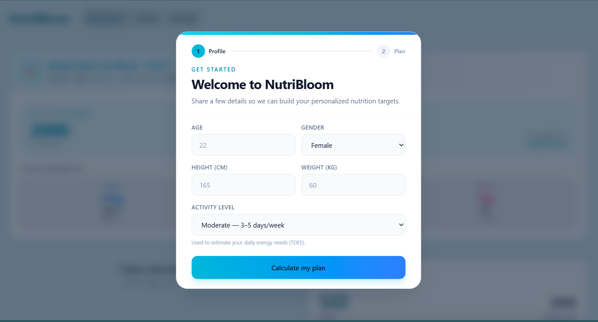
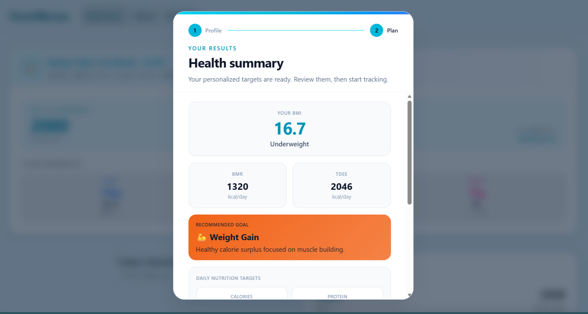
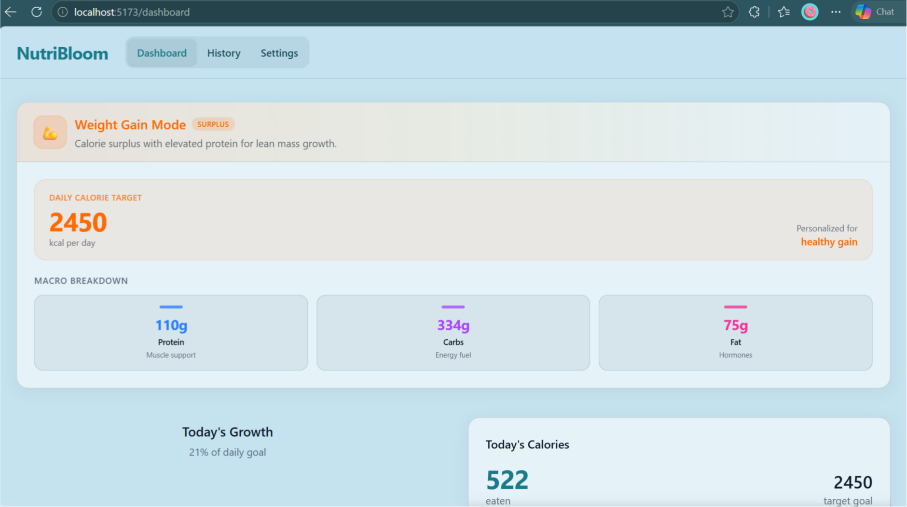
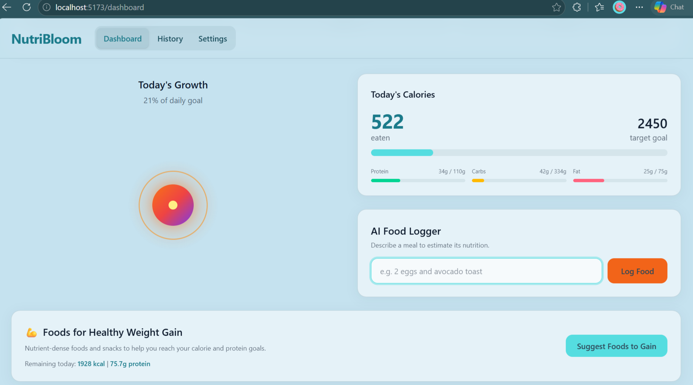
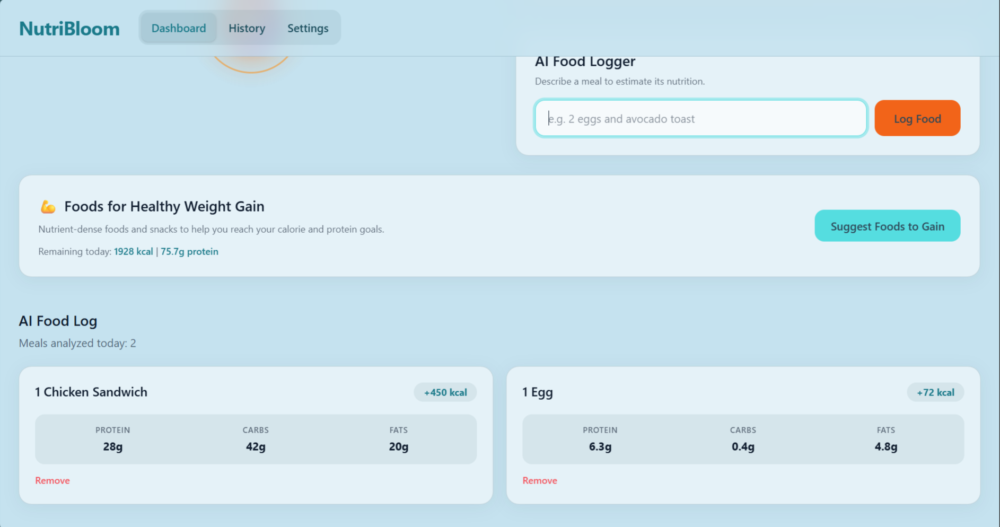
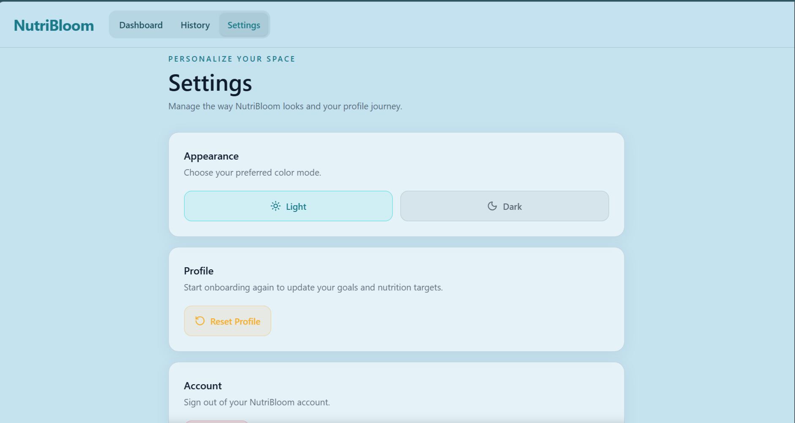
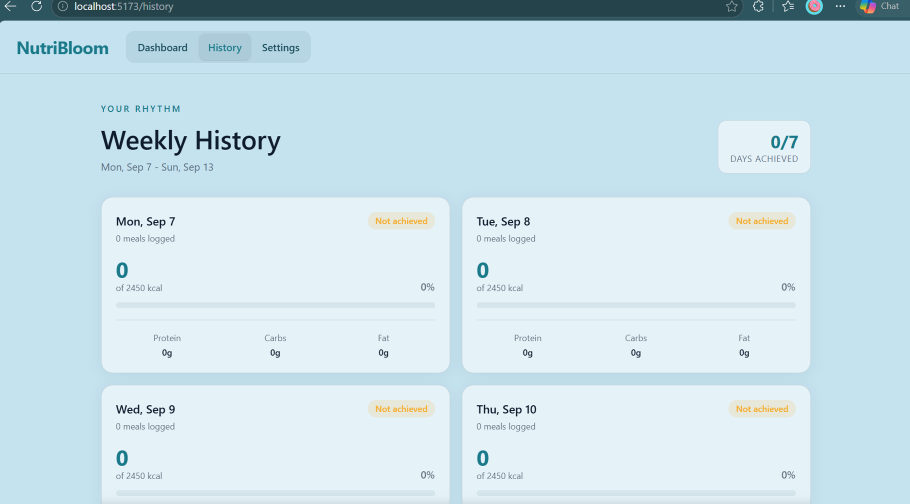

# NutriBloom

NutriBloom is a full-stack nutrition tracker that turns a user's profile and food descriptions into practical daily calorie and macronutrient guidance. It supports secure accounts, personalized goals, AI-assisted food logging, meal suggestions, and weekly progress history.

> NutriBloom provides general wellness information only. It is not a substitute for medical advice, diagnosis, or treatment.

## Live demo

[View the NutriBloom demo ](https://nutri-bloom-full-stack.vercel.app/)

## Screenshots


| Sign In | Details Modal | Result Modal |
| --- | --- | --- |
|  |  |  | 


| Dashboard | AI Food Logger section | Food Log |
| --- | --- | --- |
|  |  |  | 

| Setting | History | 
| --- | --- |
|  |  | 


## Highlights

- Personalized onboarding with BMI, BMR, and TDEE calculations
- Goal-aware plans for weight gain, weight loss, and maintenance
- AI-generated daily calorie, protein, carbohydrate, and fat targets
- Natural-language food logging with estimated nutrition
- AI meal suggestions that use remaining daily macros and the selected goal
- Daily dashboard, meal deletion, and weekly history
- Supabase email/password authentication and per-user data storage
- Responsive light and dark themes

## Tech stack

| Area | Technology |
| --- | --- |
| Client | React 19, Vite, React Router, Tailwind CSS |
| UI and motion | Lucide React, Framer Motion |
| API | Node.js, Express 5, CORS |
| Data and auth | Supabase (Postgres and Auth) |
| AI | Google Gemini via `@google/generative-ai` |

## Project structure

```text
NutriBloom/
|-- client/                 # Vite + React single-page application
|   |-- src/components/     # Dashboard, onboarding, AI, and layout components
|   |-- src/pages/          # Login, signup, dashboard, history, settings
|   |-- src/lib/            # Supabase and API helpers
|   `-- src/utils/          # Nutrition and date utilities
|-- server/                 # Express API
|   `-- src/routes/ai.js    # Gemini-powered nutrition endpoints
`-- README.md
```

## Prerequisites

- Node.js 20 or later
- A [Supabase](https://supabase.com/) project
- A Google AI Studio API key with Gemini access

## Getting started

1. Clone the repository and install dependencies in both applications.

   ```bash
   git clone (https://github.com/Nayab-Naeem/NutriBloom-FullStack.git)
   cd NutriBloom
   cd client && npm install
   cd ../server && npm install
   ```

2. Create the environment files described below.

3. Connect a Supabase project with authentication enabled and the required `profiles` and `food_logs` tables.

4. Start the API in one terminal.

   ```bash
   cd server
   npm start
   ```

5. Start the client in another terminal.

   ```bash
   cd client
   npm run dev
   ```

6. Open the URL printed by Vite (normally `http://localhost:5173`). The Vite development server proxies `/api` requests to `http://localhost:5000`.

## Environment variables


### `client/.env`

```env
VITE_SUPABASE_URL=https://your-project-ref.supabase.co
VITE_SUPABASE_ANON_KEY=your-supabase-anon-key

# Optional in development: Vite proxies /api to localhost:5000.
# Required when the API is deployed separately.
VITE_API_URL=https://your-api.example.com
```

### `server/.env`

```env
PORT=5000
GEMINI_API_KEY=your-google-ai-studio-api-key

# Add the deployed client origin in production.
CLIENT_URL=https://your-client.example.com
```

## Supabase

Configure email/password authentication and connect the client with the values in `client/.env`. NutriBloom stores user profiles and food entries in the `profiles` and `food_logs` tables. For production, configure the appropriate Site URL and redirect URLs in the Supabase dashboard.

## Available scripts

| Location | Command | Purpose |
| --- | --- | --- |
| `client` | `npm run dev` | Start the Vite development server |
| `client` | `npm run build` | Create a production client build |
| `client` | `npm run preview` | Preview the production build locally |
| `client` | `npm run lint` | Run ESLint |
| `server` | `npm start` | Start the Express server |

## API reference

The API exposes a health check and three AI endpoints. Requests use JSON.

| Method | Endpoint | Description |
| --- | --- | --- |
| `GET` | `/health` | Returns API health status |
| `POST` | `/api/nutrition-targets` | Generates calorie and macro targets from a completed profile |
| `POST` | `/api/estimate-calories` | Estimates nutrition from a food description |
| `POST` | `/api/ai/suggest-meal` | Returns three goal-aware meal or snack ideas |

Example food-estimation request:

```bash
curl -X POST http://localhost:5000/api/estimate-calories \
  -H "Content-Type: application/json" \
  -d '{"description":"2 boiled eggs with toast and a cup of milk"}'
```

## How personalization works

NutriBloom calculates BMI, then uses it to recommend an initial goal:

- BMI below 18.5 → gain
- BMI from 18.5 to below 25 → maintain
- BMI 25 or higher → lose

BMR uses the Mifflin–St Jeor equation. TDEE is calculated by applying the selected activity multiplier to BMR. Gemini then produces the daily calorie and macro targets used by the dashboard. Users can reset onboarding from Settings to recalculate their plan.

### Goal modes

| Mode | Focus | How NutriBloom adapts |
| --- | --- | --- |
| Weight gain | Supports a healthy calorie surplus with nutrient-dense choices. | AI suggestions prioritize practical higher-calorie options such as milk, eggs, oats, yogurt, rice, dates, and nuts. |
| Weight loss | Encourages a moderate calorie deficit with filling, lower-calorie choices. | AI suggestions favor light snacks, fruit, vegetables, lean protein, and unsweetened drinks, while avoiding large or calorie-dense meals. |
| Weight maintenance | Helps sustain a current healthy weight with balanced nutrition. | AI suggestions provide a flexible mix of balanced meals and snacks that fit the remaining daily targets. |

### Where AI is integrated

Gemini powers three parts of the experience:

- **Personalized targets:** After onboarding, the app sends the user's calculated BMR, TDEE, and recommended goal to the API. AI returns daily calorie and macro targets tailored to that context, making the starting plan more useful than a single fixed target for every user.
- **Food analysis:** A user can describe a meal in plain language, such as “two boiled eggs with toast.” AI estimates calories, protein, carbohydrates, fat, and food items so the entry can be logged without manually searching a nutrition database.
- **Meal suggestions:** The dashboard sends the user's remaining calories and macros, meal context, and goal to AI. It returns three realistic suggestions, with guardrails that keep weight-loss recommendations light and align other suggestions with gain or maintenance goals.


## Deployment notes

- Deploy `client` as a static Vite application and `server` as a Node.js service.
- Set `VITE_API_URL` to the public API origin when the client and API are hosted separately.
- Set `CLIENT_URL` to the public client origin so the API's CORS allowlist permits browser requests.
- Add the production client URL to Supabase Auth's allowed redirect URLs.
- Keep `GEMINI_API_KEY` server-side only; do not expose it through a `VITE_` variable.


## License

This project is licensed under the [MIT License](LICENSE).
